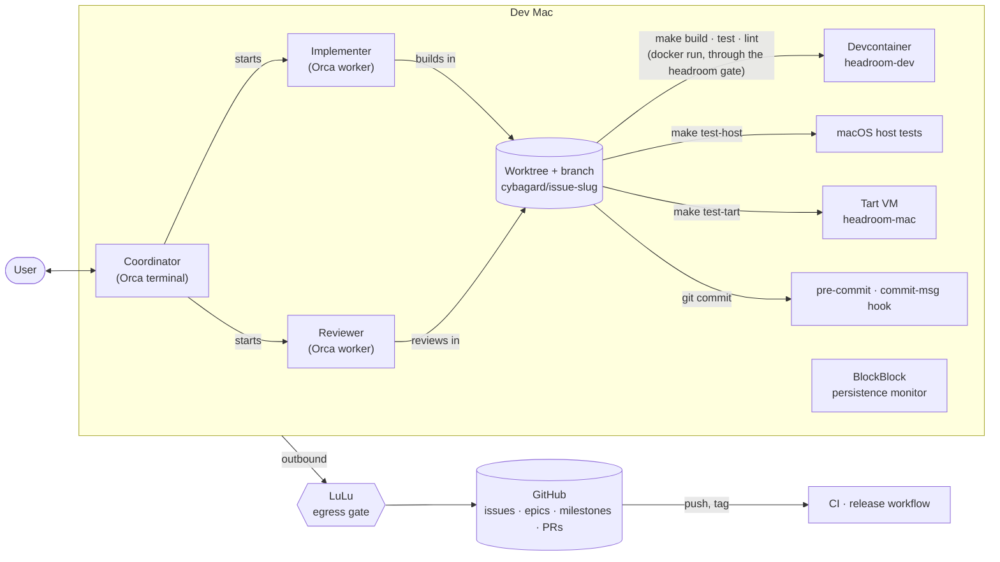

# Contributing

The [implementation plan](https://github.com/cybagard/cyba-headroom/issues?q=is%3Aissue%20label%3Aepic) is on GitHub. It has one epic issue for each phase, with its tasks as sub-issues. It has one milestone for each release. For more, see [docs/agents/issue-tracker.md](docs/agents/issue-tracker.md).

## Development harness

This section shows how the project builds, tests and delivers headroom itself. [CLAUDE.md](CLAUDE.md) has the details.

headroom is one multi-call binary in Go. [ADR 0001](docs/adr/0001-language.md) records this decision. `headroom` is the command-line tool and the daemon. When a symlink named `docker`, `podman` or `tart` points to it, it is the shim of the gate.



**Devcontainer.** `make build`, `test`, `lint`, `fmt` and `tidy` run in the `headroom-dev` image. [`.devcontainer/`](.devcontainer/) defines this image. Thus the host needs only Docker. `NATIVE=1` runs these targets directly on the host. The macOS runners of CI use it. The git hooks and the darwin test runs stay on the host.

```sh
make build   # bin/headroom
make test    # go test -race ./...
make lint    # go vet + golangci-lint
bin/headroom config   # effective config and its path
```

The make targets do these tasks:

- `make test`: `go test -race ./...`.
- `make lint`: `go vet` and `golangci-lint`, for Linux and for darwin.
- `make build`: `bin/headroom` for darwin/arm64.
- `make test-host`: the tests as darwin binaries. The container compiles them, and the host runs them.
- `make test-tart`: the same binaries in a clean macOS Tart VM, `headroom-mac`. This VM is a clone of `macos-xcode`. The target stops the VM after the run.
- `make lint-docs`: markdownlint and Vale on README.md, SECURITY.md and CONTRIBUTING.md. Each tool runs in its official container image. [`.markdownlint-cli2.yaml`](.markdownlint-cli2.yaml) and [`.vale.ini`](.vale.ini) hold their rules.
- `make hooks`: copies [`scripts/hooks/pre-commit`](scripts/hooks/pre-commit) into the git hooks of the clone, as `pre-commit` and `commit-msg`.

The hook blocks a commit when its staged file names, added lines or message name other projects. It reads these project names from Orca and from the uncommitted `.git/info/scrub-names`. It also blocks the home path, the user name, and likely secrets such as API keys, tokens and private keys.

**Global boundaries.** The dev Mac runs Objective-See's LuLu as its egress gate and BlockBlock as its persistence monitor. Nothing in this repo installs or configures them.

**Delivery loop.** The coordinator is the Orca terminal that the user talks to. The coordinator plans with the user, starts and supervises Orca workers, classifies review findings and owns the PR. An implementer is a worker that builds one issue in its own worktree and branch, `cybagard/<issue>-<slug>`. A reviewer is a worker that reviews in that worktree. Each issue goes through these steps:

1. **Pick** the next ready issue in the earliest open milestone.
2. **Plan**: the coordinator posts the plan on the issue. The user approves the plan.
3. **Build** test-first. Then run `make test lint test-host`. For macOS-only code, also run `test-tart`.
4. **Review**: a reviewer runs a standards-and-spec code review and a security review. A finding is blocking if it would hurt someone who uses headroom, or if it contradicts the plan. The implementer fixes a blocking finding minimally. The PR lists the non-blocking findings. The budget is 3 rounds for code and 1 round for docs.
5. **Ship**: the PR closes the issue and carries its milestone. The user merges the PR when CI is green.
6. **Learn**: record what later issues need in a spike note, an ADR, a later issue or CLAUDE.md.

## Releasing

To release a version, do these steps:

1. Wait until the CI run of a commit on `main` is green.
2. Tag that commit.
3. Push the tag.

```sh
git tag -a vX.Y.Z -m "headroom vX.Y.Z" && git push origin vX.Y.Z
```

The [release workflow](.github/workflows/release.yml) tests and lints the tag. It builds `headroom` for darwin/arm64, with the tag as its version. Then it publishes `headroom-vX.Y.Z-darwin-arm64.tar.gz` and `SHA256SUMS` as a GitHub release. The tarball holds the binary, LICENSE and README. The workflow marks each `v0.*` release as a pre-release.

After the release, close the milestone of the version.
