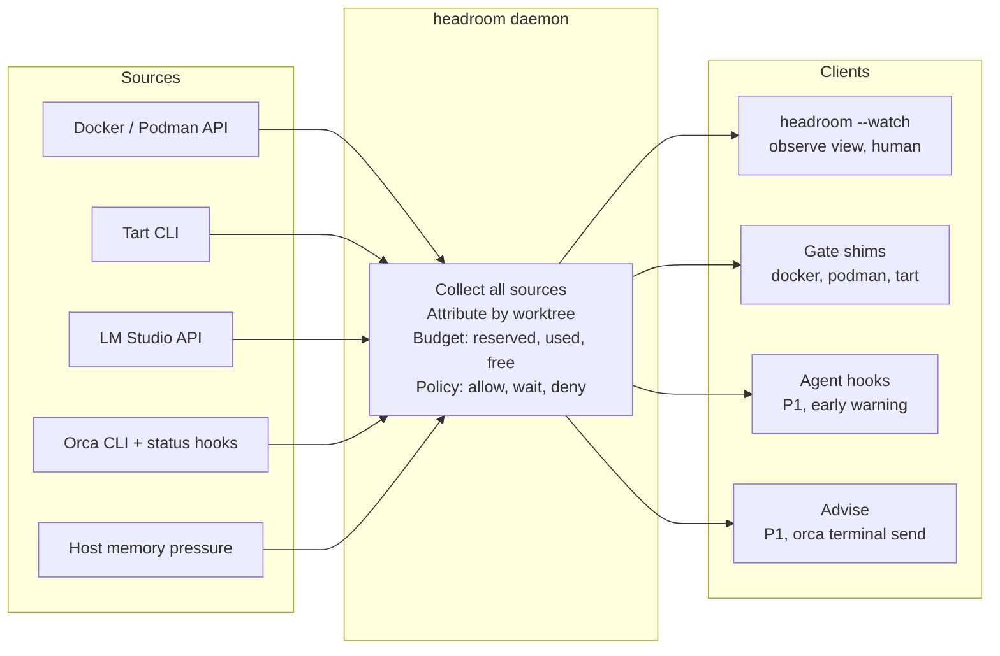

# Architecture

## Architecture

One daemon reads every source and owns the budget; all clients are thin and ask the same daemon.

Only the gate shims change what happens: they exec the real binary on allow, or hand the agent a reason on wait or deny. If the daemon is unreachable, they exec straight through.

### Enforcement layers

Defense in depth: one authoritative gate; the other layers set up, warn or detect.

1. **Orca launch environment (setup).** Puts the shims first on PATH and sets `HEADROOM_WORKTREE` for every agent (R9). Not a gate, but it fixes the shim's two weak spots: PATH order and identity.
2. **Gate shim (enforce).** The only authoritative decision, at the exec level, for every agent and however deeply nested the call (R5, R10).
3. **Agent hooks (warn, P1).** Deny obvious cases before the agent spends effort, with the reason fed to the model, and add session-level attribution. Advisory, since they only see the command string.
4. **Observe mode (detect).** Flags anything that got around the first three, such as direct Docker socket use, as ungated (R4).

