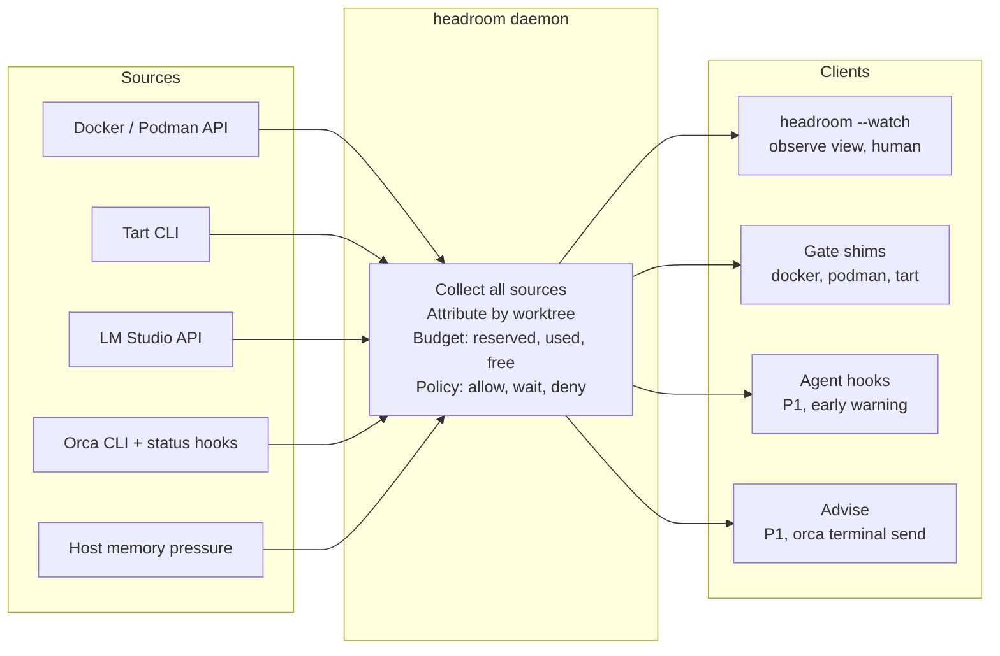

# headroom — Product Spec

Oct 7, 2026 · @cybagard · repo `cyba-headroom`, binary `headroom`

**Licence:** MIT, `Copyright (c) 2026 cybagard`. `LICENSE` file at the repo root, `License: MIT` at the end of the README. No CLA needed.

## Problem statement

`headroom` is admission control for a fleet of parallel coding agents on one Mac: it shows what each agent costs across Docker/Podman, Tart and LM Studio, and it lets agents ask before they spawn more. Display alone is not the product; the gate is.

The stack: Orca runs several agents in parallel, each in its own git worktree, using Claude CLI and Kilo Code. Agents launch Docker or Podman containers and Tart macOS VMs from inside their worktree; Kilo Code sends inference to LM Studio. All of it shares 64 GB of unified memory on one M4 Max.

No layer sees the others. Orca knows an agent is "working", not that it holds 6 GB of idle containers. Docker shows one VM process, not which agent filled it. Tart has no usage view at all. When several agents build at once, the machine swaps, LM Studio's model gets evicted, every agent slows down at the same time, and nothing reports why. A third Tart runner fails outright, because macOS allows only two concurrent macOS VMs per host.

## Goals

1. **No thrash from the fleet.** Running 3+ agents in parallel no longer pushes the host into sustained swap or red memory pressure.
2. **Every resource has an owner.** Each container, VM and loaded model is attributed to an Orca worktree, or explicitly flagged as unattributed.
3. **Agents negotiate instead of failing.** When there is no room, an agent gets a reason and an alternative (reuse, stop, wait), not an out-of-memory crash or a cryptic Tart error.
4. **One glance answers "who is costing me what".** The human can see the full budget and the top consumer in under 5 seconds.
5. **Leaks get found.** Orphaned containers, VMs and Tart clones from finished or deleted worktrees are surfaced within minutes, not discovered weeks later as missing disk.

## Non-goals

- **Not a general system monitor.** `btop`, `lazydocker` and `ctop` already do host and container views well; `headroom` shows only what serves the budget question.
- **Not a security boundary.** The gate is cooperative. An agent can call the real binary or the Docker socket directly; that is detected, not prevented.
- **Not a proxy for LM Studio.** Model loads are controlled through LM Studio's own settings (single loaded model, idle TTL), not intercepted.
- **Not CI pipeline monitoring.** Queue depth, flaky retries and stage timings are a different product.
- **No remote placement.** Deciding which agents run on Orca's remote runtimes is out of scope for v1; only local resources are budgeted.
- **No Linux Tart guests yet.** macOS guests only; Linux guests are a future case.

## User stories

**Developer running the fleet (human)**

- As a developer running parallel agents, I want to see how much memory is reserved, used and free across all runtimes so that I know whether I can start another agent.
- As a developer, I want each container, VM and model attributed to the worktree that started it so that I know which agent to stop.
- As a developer, I want waiting or idle agents that still hold resources highlighted so that I can reclaim memory without hunting for it.
- As a developer, I want orphaned containers, VMs and Tart clones listed so that I can clean up leaks from finished worktrees.
- As a developer, I want to send an agent a back-off message from the same tool so that I don't switch into the Orca UI to intervene.
- As a developer, I want the gate to fail open when the daemon is down so that a crashed monitor never blocks my CI.

**Coding agent (Claude CLI, Kilo Code)**

- As an agent, I want a clear deny message with a reason and alternatives when I try to start a container that won't fit so that I can reuse, clean up or wait instead of failing.
- As an agent, I want to queue for a macOS VM slot when both are taken so that my test run starts as soon as a slot frees up.
- As an agent, I want my existing idle containers named in the deny message so that I can reuse them instead of starting new ones.

## Requirements

### Must-have (P0)

**R1 — Collector daemon.** One background process reads all sources on a fixed interval and holds the current budget.

- [ ] Reads Docker Desktop or Podman via the Docker-compatible API socket, including per-container memory and labels
- [ ] Reads the container VM ceiling (`docker info` or `podman machine inspect`) and the host-side RSS of the VM process
- [ ] Reads Tart VMs (`tart list`) with configured memory, state and disk size
- [ ] Reads LM Studio's loaded model and size from its local API
- [ ] Reads Orca worktrees and agent state (working / waiting / done) via `orca worktree ps --json` and the agent status hooks
- [ ] Reads host memory pressure and swap without sudo
- [ ] If Docker Desktop and Podman VMs are both running, flags it as a warning

**R2 — Budget model.** The budget is reserved vs. used vs. headroom, not free memory.

- [ ] Reserved = container VM ceiling + configured memory of running Tart VMs + loaded model size + host baseline
- [ ] A loaded model counts as reserved even when idle
- [ ] Headroom = 64 GB minus reserved, shown next to memory pressure and swap

**R3 — Worktree attribution.** The worktree path is the join key.

- [ ] Containers attributed by compose project label, bind-mount path or launching process cwd
- [ ] Tart VMs attributed by naming convention (VM name contains the worktree name) or by the cwd of the `tart run` process
- [ ] Anything that matches no live worktree appears under **unattributed**
- [ ] Given a container started from worktree `fix-login`, when the view refreshes, then it appears under `fix-login`

**R4 — Observe view.** `headroom` prints once; `headroom --watch` refreshes in place.

- [ ] Top line: host total, reserved, used, headroom, swap, pressure, plus the 5-minute pressure trend
- [ ] One row per worktree: agent, state, containers + GB, Tart VMs + GB, CPU
- [ ] Rows where the agent is waiting or done but still holds resources are marked
- [ ] Unattributed row always shown when non-empty
- [ ] Containers or VMs that appear without a matching lease (R10) are flagged as **ungated**: direct socket use, SDKs such as Testcontainers, or a broken PATH

**R5 — Gate shim for `docker`, `podman` and `tart` (authoritative).** One global shim directory, put first on PATH by the Orca launch environment (R9). It is the only enforcement point; agent hooks and MCP are advisory.

- [ ] Finds the real binary by removing its own directory from PATH; never calls itself
- [ ] Parses global flags and long forms (`docker --context x run`, `docker container run`, `docker compose -f a.yml up`) to recognize resource-creating calls: `run`, `create`, `start`, `compose up`, `tart run`, `tart clone`
- [ ] Everything else passes straight through without contacting the daemon
- [ ] Resolves identity in order: `HEADROOM_WORKTREE`, git toplevel of the cwd, process ancestry; calls with no Orca worktree (a human typing `docker`) pass through and are attributed as **manual**
- [ ] On allow, replaces itself with the real binary (`exec`), so TTY, signals and exit codes behave as if the shim were not there
- [ ] On deny, exits 75 (temporary failure) with a message written for an agent: headroom, estimated cost, and the agent's own idle resources it could reuse or stop
- [ ] `BUDGET_WAIT=1` queues the request instead of denying, with a timeout
- [ ] Resolves `docker` aliased to `podman` to the real target

**R6 — macOS VM slot gate.** Tart is gated on count first, memory second.

- [ ] Given two macOS VMs running, when a third `tart run` is requested, then the shim denies or queues it with the names of the two slot holders
- [ ] Slots held by waiting or done agents are named first in the message

**R7 — Fail open.**

- [ ] If the daemon is unreachable within 500 ms, the shim execs the real binary and prints a one-line warning
- [ ] The gate never blocks a command that does not create resources

**R8 — Fixed-threshold policy.**

- [ ] Configurable minimum headroom (default to be set after measurement)
- [ ] Configurable per-worktree cap in GB
- [ ] A waiting or done agent cannot start new resources while it holds idle ones
- [ ] Config in `~/.config/headroom`

**R9 — Orca launch environment.** Every agent Orca launches starts with the shim directory first on PATH and `HEADROOM_WORKTREE` set. Variables set in the agent's own process reach its tool shells, which is more reliable than direnv or `.zshenv`.

- [ ] Set through Orca's agent launch command or environment; fallback: a worktree setup hook that writes a small wrapper script used as the agent command
- [ ] Given an agent launched by Orca, when it runs a tool command in a non-interactive shell, then `command -v docker` resolves to the shim
- [ ] Verified separately for Claude CLI and Kilo Code tool shells, including login shells where `path_helper` reorders PATH
- [ ] `headroom doctor`, run inside a worktree terminal, checks PATH order and identity and says what is wrong

**R10 — Leases.** An allow reserves the estimated cost until the resource appears, so simultaneous requests cannot overcommit.

- [ ] Given two agents each request 6 GB with 8 GB headroom at the same moment, then exactly one is allowed and the other waits or is denied
- [ ] A lease turns into tracked usage when its container or VM appears, or expires after a timeout (default 2 minutes)
- [ ] Expired leases are logged

### Nice-to-have (P1)

- **Learned cost estimates.** Record peak memory per compose project and image; estimate new requests by p95 of past runs, conservative default for unknown ones.
- **Agent hooks (early warning).** Claude Code's PreToolUse hook, and Kilo's equivalent if it has one, ask the daemon before a command runs, deny obvious cases with the reason fed straight to the model, and add session-level attribution. Advisory only: they see the command string the model typed, so `make ci` or a script that calls `docker` passes unseen. The shim stays authoritative.
- **Advise mode.** Send back-off messages to agents via `orca terminal send` or a worktree comment, manually from the view or automatically on red pressure.
- **Tart disk view.** Disk usage per Tart clone, flagging clones whose worktree no longer exists.
- **LM Studio swap counter.** Model loads and evictions in the last hour, with which agent's request triggered them where inferable.
- **MCP tool.** `budget.check` / `budget.status` so agents can ask before planning work.
- **Audit log.** Every allow / deny / wait decision with worktree, command and numbers.

### Future (P2)

- Linux Tart guests (outside the two-macOS-VM limit; memory-gated like containers)
- Placement advice: which worktrees should move to an Orca remote runtime given local headroom
- Priority ordering, e.g. the human's foreground worktree first
- Full TUI (Textual) once the `--watch` view has proven which columns matter

## Architecture

One daemon reads every source and owns the budget; all clients are thin and ask the same daemon.

Only the gate shims change what happens: they exec the real binary on allow, or hand the agent a reason on wait or deny. If the daemon is unreachable, they exec straight through.

### Enforcement layers

Defense in depth: one authoritative gate; the other layers set up, warn or detect.

1. **Orca launch environment (setup).** Puts the shims first on PATH and sets `HEADROOM_WORKTREE` for every agent (R9). Not a gate, but it fixes the shim's two weak spots: PATH order and identity.
2. **Gate shim (enforce).** The only authoritative decision, at the exec level, for every agent and however deeply nested the call (R5, R10).
3. **Agent hooks (warn, P1).** Deny obvious cases before the agent spends effort, with the reason fed to the model, and add session-level attribution. Advisory, since they only see the command string.
4. **Observe mode (detect).** Flags anything that got around the first three, such as direct Docker socket use, as ungated (R4).

## Success metrics

Measure a two-week baseline with observe mode only, then two weeks with the gate on. Targets below are starting hypotheses to revise after the baseline.

| Metric | Type | Target | How measured |
| --- | --- | --- | --- |
| Minutes per day in red memory pressure | Leading | Down 80% vs. baseline | Daemon samples pressure every interval |
| Swap used during multi-agent runs | Leading | Under 2 GB peak | Daemon swap samples |
| Attributed share of reserved memory | Leading | Over 95% | Reserved GB under worktrees ÷ total reserved |
| Agent recovery after a deny | Leading | Over 70% reuse, stop or wait instead of failing | Audit log + next command from that worktree |
| Tart "too many VMs" failures | Leading | Zero | Audit log + Tart errors |
| Orphaned resources older than 1 hour | Lagging | Zero at any time | Unattributed row age |
| Gate false denies | Lagging | Under 1 per day | Denies where actual peak later fit in headroom |
| Parallel agents sustained without thrash | Lagging | Up from baseline, ideally 4+ | Max concurrent working agents with pressure not red |

## Open questions

**Blocking (answer before building)**

- [ ] What exactly does `orca worktree ps --json` return: PIDs, paths, agent state? Decides whether attribution can walk the process tree or must rely on paths and labels. *(engineering, spike)*
- [ ] Can Orca set a launch command or environment per agent, so PATH and `HEADROOM_WORKTREE` reach every agent? If not, does a wrapper script as the agent command work? *(engineering, spike)*
- [ ] In the tool shells Claude CLI and Kilo actually spawn, does the injected PATH survive (login vs. non-login shells, `path_helper`)? *(engineering, spike)*
- [ ] How do Docker Desktop and Podman report per-container memory on this machine, and how far does it differ from the host-side RSS of their VMs? *(engineering, measurement)*

**Non-blocking (resolve during build)**

- [ ] Default minimum headroom and per-worktree cap: set from the two-week baseline. *(data)*
- [ ] Host baseline to reserve for macOS, Orca and the agents' own processes. *(data)*
- [ ] Does LM Studio's API expose loaded model memory, or only the model file size? *(engineering)*
- [ ] Tart VM naming convention: enforce `<worktree>-<suffix>` via the shim, or attribute by process cwd only? *(engineering)*
- [x] Language and packaging: Python for speed of build, or Go for a single static binary the shims call quickly? *(engineering)* → **Go**, see [ADR 0001](adr/0001-language.md)
- [ ] Shim latency budget: the daemon check must not noticeably slow every `docker` call. *(engineering)*
- [ ] Does Kilo's CLI offer a before-tool-execution hook (its `.kilo` JS plugins suggest an OpenCode-style one), and can it deny with a message to the model? Decides whether P1 agent hooks cover Kilo. *(engineering)*

## Phasing

No hard deadlines; each phase works on its own and gates the next.

1. **Spike.** Answer the four blocking questions. Exit when attribution and the Orca launch environment are confirmed to reach every agent's tool shells.
2. **Observe.** Daemon, budget model, attribution and `headroom --watch` (R1–R4). Run for two weeks to collect the baseline and set default thresholds.
3. **Gate.** Launch environment, shims, leases, macOS slot gate, fail-open and fixed-threshold policy (R5–R10). Exit when agents recover from denies without human help in most cases.
4. **Learn and advise.** Learned cost estimates, advise mode, Tart disk view, audit log (P1).
5. **Later.** Linux Tart guests, placement advice, TUI (P2).
